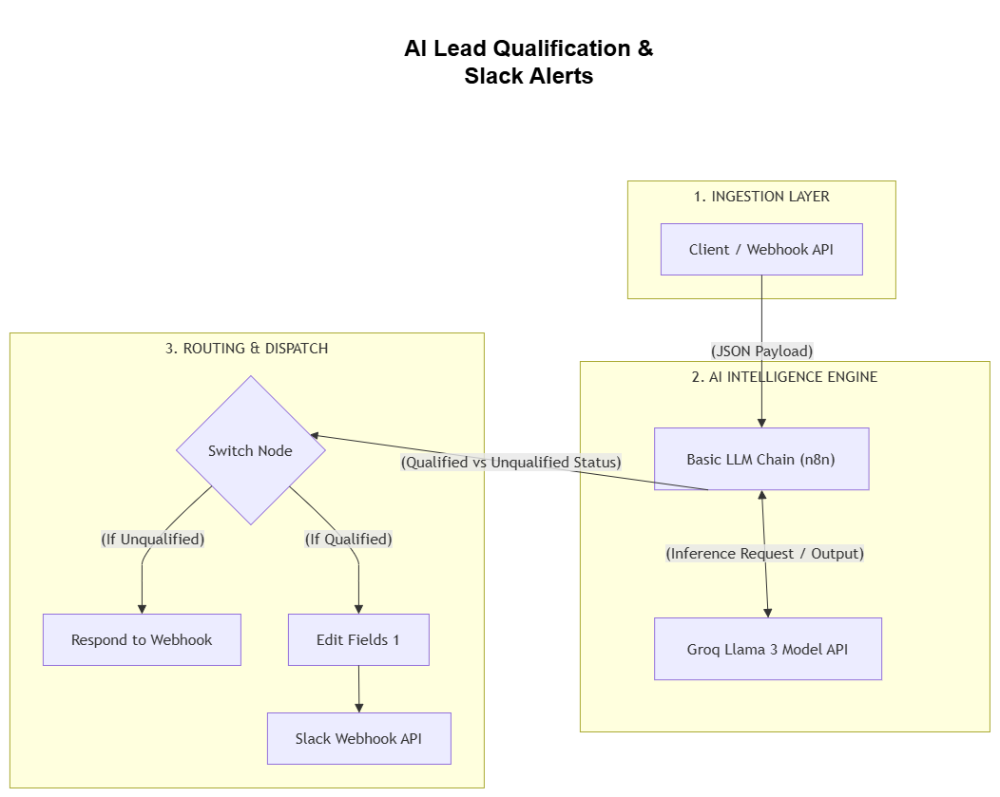

# AI Lead Qualification & Slack Alerts Engine

An end-to-end automated B2B lead)]aluation pipeline built using l8n and LLM inference. The system receives inbound webhook payloads, evaluates prospective leads against BANT (Budget, Authority, Need, Timing) criteria via Groq LLM scoring, and conditionally dispatches real-time alerts to Slack channels for high-value leads.

---

## 𝓐 System Architecture



### Workflow Breakdown
1. *(Ingestion Layer:** Inbound POST webhook receives raw B2B lead JSON payloads (`fullName`, company`, budget`, `role`).
2. **AI Intelligence Engine:** `Basic LLM Chain` paired with `Groq Chat Model (ALLaM / Llama-3)` evaluates the lead using structured prompt engineering and returns a raw JSON score (`0-100`).
3. **Routing & Dispatch:**
   * **Score > 70 (VIP Lead):** Formats alert metadata and posts a real-time message to the `#all-sales-vip-alerts` Slack channel via Webhook API.
   * **Score � 70 (Standard Lead):** Formats standard nurture logs and completes execution with a Webhook response.

---

## 𝓰 Tech Stack
* **Orchestration:** n8n (Visual Automation Engine)
* **LLM Provider:** Groq API (`allam-2-7b` / Llama-3)
* **Communication:** Slack Incoming Webhooks API
* **Data Protocol:** REST / JCON Webhooks

---

## 𝓙 How to Import & Run

1. Clone this repository:
   ```bash
   git clone https://github.com/Marksman247/ai-lead-qualification-slack-alerts.git
   ```F2. Import `workflows/workflow.json` into your n8n instance.
3. Configure your **Groq API credentials** inside n8n.
4. Set up an environment variable or update the HTTP Request node with your *(Slack Incoming Webhook URL**.
5. Test the inbound webhook using PowerShell:

```powershell
$webhookUrl = "http://localhost:5678/webhook-test/lead-qualify-input-v2"

$payload = @{
    fullName    = "Sarah Connor"
    company     = "Cyberdyne Systems"
    email       = "s.connor@cyberdyne.com"
    companySize = "250"
    budget      = "$25,000"
    role        = "VP of Operations"
} | ConvertTo-Json

Invoke-RestMethod -Uri $webhookUrl -Method Post -Body $payload -ContentType "application/json"
```

---

## 𝓎 Security & Data Privacy
All sensitive webhook URLs and API keys have been stripped and replaced with environment variable parameters (`{{Fenv.SLACK_WEBHOOK_URL}}`).


